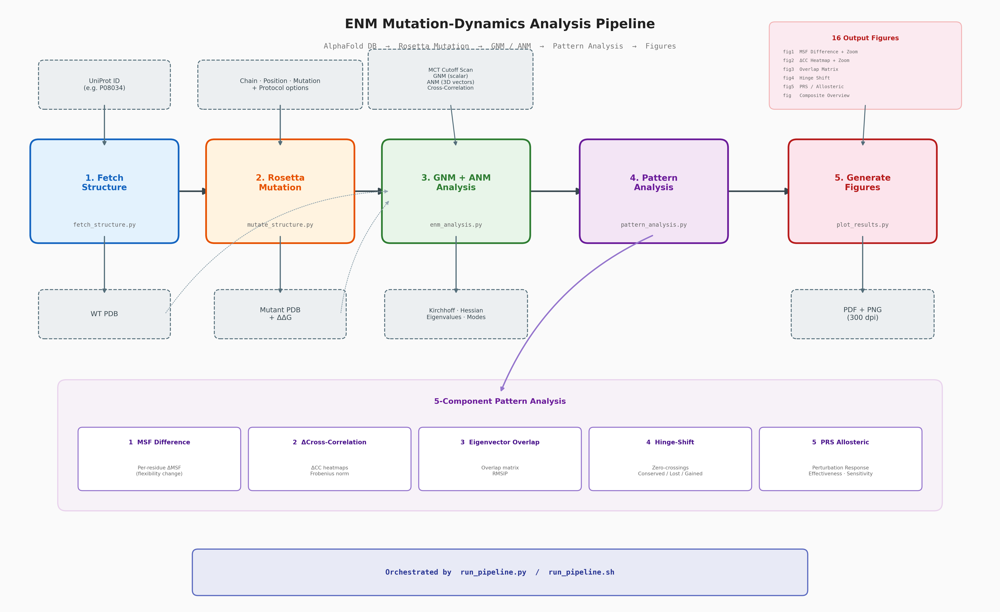

Pipeline for analyzing impact of point mutations using elastic-network models (GNM + ANM)



| Step | Module | Description |
|------|--------|-------------|
| 1 | `fetch_structure.py` | Download WT structure from AlphaFold by UniProt ID |
| 2 | `mutate_structure.py` | Introduce mutation via PyRosetta (restrained local FastRelax) |
| 3 | `enm_analysis.py` | GNM + ANM: MCT cutoff scan, modes, cross-correlation, comparison |
| 4 | `pattern_analysis.py` | 5-part analysis: MSF Δ, ΔCC, eigenvector overlap, hinges, PRS |
| 5 | `plot_results.py` | Plot figures (12+ plots, PDF + PNG at 300 dpi) |
| 6 | `generate_table.py` | LaTeX summary table with all key numerical statistics |

## Slow Start

```bash
# Install dependencies
pip install numpy prody matplotlib biopython

# Using UniProt accession
./run_pipeline.sh --uniprot P01234 --chain A --position 1 --mutation B

# Using existing PDB
./run_pipeline.sh --wt-pdb protein.pdb --chain A --position 123 --mutation B \
                  --outdir results/mutant
```

---

```bash
./run_pipeline.sh [OPTIONS]

# Required
  --chain CHAIN         Chain identifier (e.g. A)
  --position POS        Residue position (PDB numbering)
  --mutation AA         Target amino acid (single or three-letter code)

# Structure source (one required)
  --uniprot ID          UniProt accession → AlphaFold download
  --wt-pdb FILE         Existing wild-type PDB file

# Output
  --outdir DIR          Output directory (default: results/<mutation>/)
```

### Rosetta Options

| Flag | Default | Description |
|------|---------|-------------|
| `--protocol` | `restrained-relax` | `repack` / `relax` / `restrained-relax` |
| `--radius` | `8.0` | Neighbourhood radius (Å) for repacking |
| `--rounds` | `3` | Independent repack/relax trajectories |
| `--coord-sdev` | `0.5` | Harmonic constraint SD (Å) |

**Restrained-relax** protocol preserves global $Cα$ geometry via harmonic coordinate constraints
while allowing mutation neighbourhood to adopt physically reasonable conformation

### ENM Options

| Flag | Default | Description |
|------|---------|-------------|
| `--modes` | `20` | Number of normal modes to compute |


## Output Structure

```
<outdir>/
├── wt/                         Wild-type PDB
├── mutant/                     Mutant PDB (from Rosetta)
├── analysis/                   GNM + ANM raw data
│   ├── gnm_wt/                 GNM WT: Kirchhoff, eigenvalues, sqflucts, CC, modes
│   ├── gnm_mut/                GNM MUT
│   ├── anm_wt/                 ANM WT: Hessian, eigenvalues, sqflucts, CC, modes
│   ├── anm_mut/                ANM MUT
│   ├── comparison/             ΔSqFluct, mode overlaps, ΔCC, subspace overlap
│   ├── mct_scan/               Minimum Connectivity Threshold scan results
│   └── master_results.json
├── patterns/                   5-part pattern analysis
│   ├── 1_msf_difference/       Per-residue ΔMSF (GNM + ANM)
│   ├── 2_crosscorr_comparison/ ΔCC heatmaps, Frobenius norm, per-residue coupling
│   ├── 3_eigenvector_overlap/  Pairwise overlap matrix, RMSIP, cumulative overlap
│   ├── 4_hinge_shift/          GNM zero-crossings, conserved/lost/gained hinges
│   ├── 5_prs_allosteric/       PRS matrices, effectiveness, sensitivity, N-term propagation
│   └── master_pattern_results.json
├── figures/                    Publication-grade plots (PDF + PNG, 300 dpi)
│   ├── fig1_gnm_msf_difference.pdf/png
│   ├── fig1_anm_msf_difference.pdf/png
│   ├── fig1_gnm_msf_zoom.pdf/png
│   ├── fig1_anm_msf_zoom.pdf/png
│   ├── fig2g_delta_crosscorr_gnm.pdf/png
│   ├── fig2a_delta_crosscorr_anm.pdf/png
│   ├── fig2c_mean_abs_delta_cc.pdf/png
│   ├── fig2_gnm_delta_cc_zoom.pdf/png
│   ├── fig2_anm_delta_cc_zoom.pdf/png
│   ├── fig3a_overlap_matrices.pdf/png
│   ├── fig3b_diagonal_overlap.pdf/png
│   ├── fig4_hinge_shift.pdf/png
│   ├── fig5a_delta_prs_heatmap.pdf/png
│   ├── fig5b_effectiveness_sensitivity.pdf/png
│   ├── fig5c_nterm_propagation.pdf/png
│   └── fig_composite_overview.pdf/png
├── pipeline_results.json       Master results summary
├── summary_table.tex           LaTeX table with all key statistics
└── rosetta_results.json        ΔΔG and Rosetta metrics
```

## Dependencies

```
numpy>=1.21.0        # Array operations
prody>=2.0           # Elastic network models (GNM/ANM)
matplotlib>=3.4.0    # Publication-grade figures
biopython>=1.79      # PDB parsing utilities
pyrosetta            # Rosetta mutation (optional — can be skipped)
```

## Analysis Components

### 1. MSF Difference
Per-residue mean-square fluctuation ($\langle \delta R_i^2 \rangle$) for WT and
mutant. $\Delta\text{MSF} = \text{MSF}_\text{MUT} - \text{MSF}_\text{WT}$.

### 2. Cross-Correlation
Full $N \times N$ cross-correlation matrices from GNM (scalar) and ANM (3D).
$\Delta\text{CC}$ heatmaps and per-residue mean $|\Delta\text{CC}|$ identify
coupling changes. Frobenius norm quantifies overall perturbation magnitude.

### 3. Eigenvector Overlap
Pairwise overlap matrix $O_{ij} = |\langle u_i^\text{WT} | u_j^\text{MUT} \rangle|$
measures how well mutant modes reproduce WT motions. RMSIP (root-mean-square
inner product) over the first 10 modes provides a single subspace similarity
metric.

### 4. Hinge-Shift Analysis
GNM eigenvector zero-crossings identify mechanical hinge residues.

### 5. PRS / Allosteric Communication
Perturbation Response Scanning models signal propagation: a unit force at
residue $i$ produces a displacement profile across all residues.